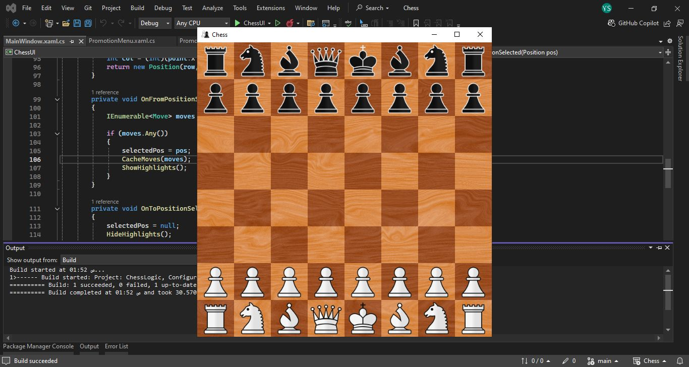
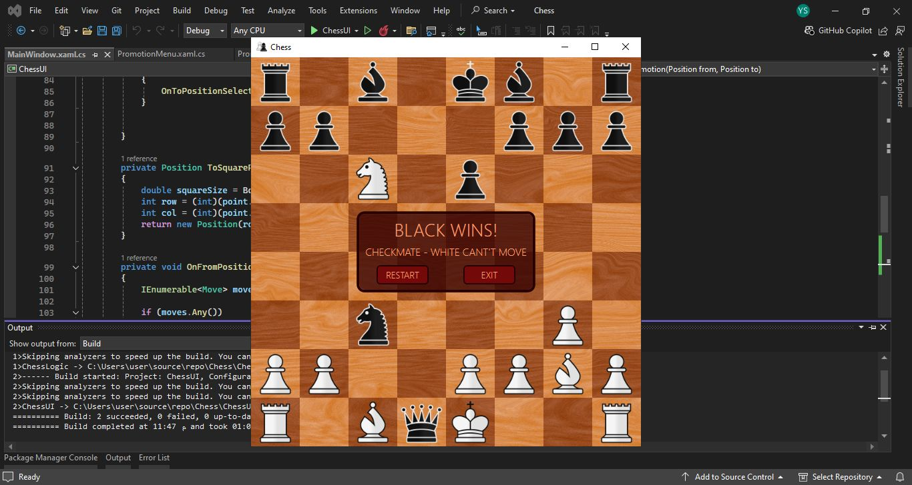
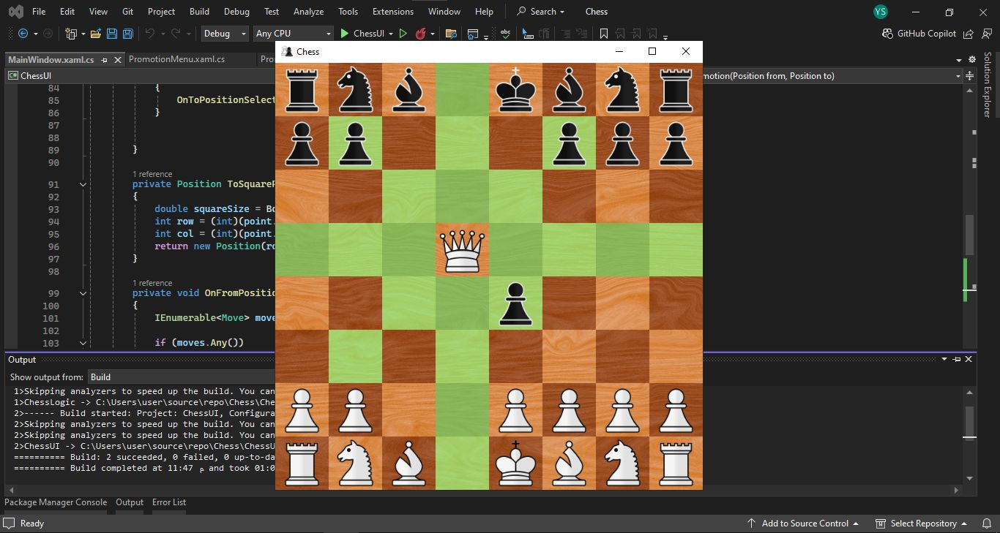
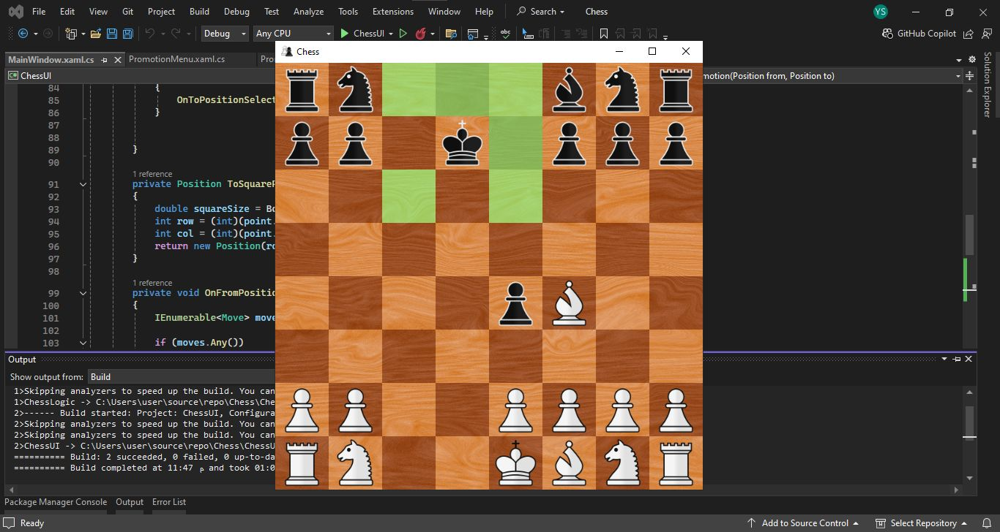
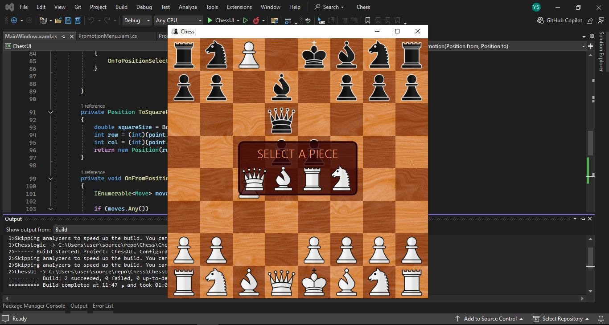

# Chess

##Screenshots

 More screenshots 

## Overview
Chess Game is a C# console-based chess game that allows players to compete in a turn-based manner. The game includes essential chess mechanics along with additional features for an enhanced experience.

## Features
- **Winner Screen**: Displays the winner and the method of victory. Players can choose to exit the game or restart a new round.
- **Check Mechanic**: When the king is in check, other pieces can only move in a way that defends the king.
- **Move Highlighting**: Highlights the possible movement range of each piece.
- **Pawn Promotion**: Pawns can be promoted upon reaching the opponent's back rank.
- **Legal Move Restrictions**: Prevents illegal moves and ensures adherence to chess rules.
- **Chess960**: Supports Chess960, a variant of chess where the back-rank pieces are shuffled randomly, creating a unique game setup.

## Upcoming Features
- **Castling**: Implement king-side and queen-side castling mechanics.
- **Stalemate**: Detect and handle stalemate situations.
- **En Passant**: Add support for the en passant rule.
- **Additional Improvements**: Further refinements and enhancements to gameplay.

## Quality & Testing
- **Unit Testing**: Includes unit tests to ensure the correctness of game mechanics and features. Tests cover critical parts of the code to help maintain stability and detect issues early.

## Installation & Usage
1. Clone the repository.
2. Open the project in Visual Studio.
3. Build and run the project to start playing.

## Contributing
Contributions are welcome! Feel free to submit feature requests, report bugs, or suggest improvements.

## Acknowledgements
A special thanks to Snake-EyE-12 for adding the Chess960 feature and enhancing the gameplay experience.
